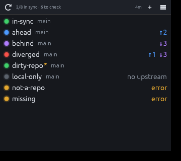

# meerkat

A small desktop widget (Rust + [egui](https://github.com/emilk/egui)) that keeps an eye
on a list of local git repositories: periodically, or when you press the reload button,
it runs `git fetch` and shows the sync state of the current branch against its
upstream on `origin`.



| Light | Meaning |
|-------|---------|
| 🟢 green  | in sync with the upstream |
| 🔵 blue   | you have extra commits (`↑N`, to push) |
| 🟣 violet | you are missing commits (`↓N`, to pull) |
| 🔴 red    | diverged (`↑N ↓M`) |
| ⚫ gray   | no upstream / detached HEAD / not checked yet |
| 🟠 amber  | error (missing folder, not a git repo…) |

Other indicators: an amber `*` next to the name = uncommitted changes;
`⚠` = the last `git fetch` failed (the state shown is based on the last known remote refs).
Hovering over a row shows the path, branch → upstream, details and errors.

## Usage

```sh
cargo run --release                 # uses ./meerkat.txt
cargo run --release -- path/list.txt -i 10
```

```
meerkat [LIST_FILE] [-i MINUTES] [-f]

  LIST_FILE        repository list, one path per line
                   (default: ./meerkat.txt; if it is a directory: DIR/meerkat.txt)
  -i, --interval   minutes between automatic fetches, 0 = off (default: 5)
  -f, --foreground stay attached to the terminal it was started from
```

When started from a terminal on Linux, meerkat detaches into the background and
gives the terminal back right away (closing the terminal does not close the window).
Use `-f` to keep it in the foreground, e.g. to see error output.

### The `meerkat.txt` file

One local path per line. Empty lines and lines starting with `#` are ignored;
relative paths are resolved against the file's folder.

```
# work
C:\src\project-a
/home/me/src/project-b
../other-repo
```

The file is rewritten when you add, remove or reorder repositories from the UI
(comments are not preserved in that case).

### Interface

- **⟳** (or `F5`): fetch all repositories. The counter at the top right shows the time to the next automatic fetch.
- **+**: add a repository by typing its path; alternatively, drop one or more folders onto the window.
- **☰**: auto-fetch interval, "always on top", reload/open the list file.
- Right-click on a row: fetch that repo, open folder, copy path, move up/down, remove.
  Double-click: open the folder.
- `Ctrl` `+` / `Ctrl` `-` / `Ctrl` `0`: zoom the interface.

## Technical notes

- Uses the installed `git` command (it must be on the `PATH`), so it honours your
  credential helpers, SSH agent, proxies and git configuration. Fetches run in the
  background (up to 6 repositories in parallel) with `GIT_TERMINAL_PROMPT=0`, so a
  repository asking for a password never blocks anything; each fetch times out after 90 s.
- The upstream is the one configured for the branch (`@{upstream}`); if there is none,
  `origin/<branch>` is used when it exists.
- Hi-DPI: the scale factor comes from the system (per-monitor on Windows, X11 and Wayland);
  all indicators are drawn as vector graphics.
- OpenGL renderer (glow). On Windows the release build does not open a console window;
  on Linux the process detaches from the terminal it was started from (see `-f`).

## Build

Requires a recent stable Rust toolchain (edition 2024).

```sh
cargo build --release
```

On Linux the standard desktop libraries are needed at runtime (`libxkbcommon`,
`libGL`/`libEGL`, `libwayland` or `libX11`); on minimal Ubuntu/Debian installs:
`sudo apt install libxkbcommon-x11-0 libgl1 libegl1`.

## Release

Pushing a tag that points to a commit on `main` triggers the
[`release.yml`](.github/workflows/release.yml) action, which builds the executables and
attaches them to the GitHub release named after the tag (creating it if it does not exist):

- `meerkat-<tag>-linux-amd64.tar.gz`
- `meerkat-<tag>-windows-amd64.zip` (statically linked CRT, no runtime to install)
- `SHA256SUMS.txt`

```sh
git tag v0.1.0 main
git push origin v0.1.0
```

A tag on a commit that is not part of `main` makes the action fail without publishing anything.
